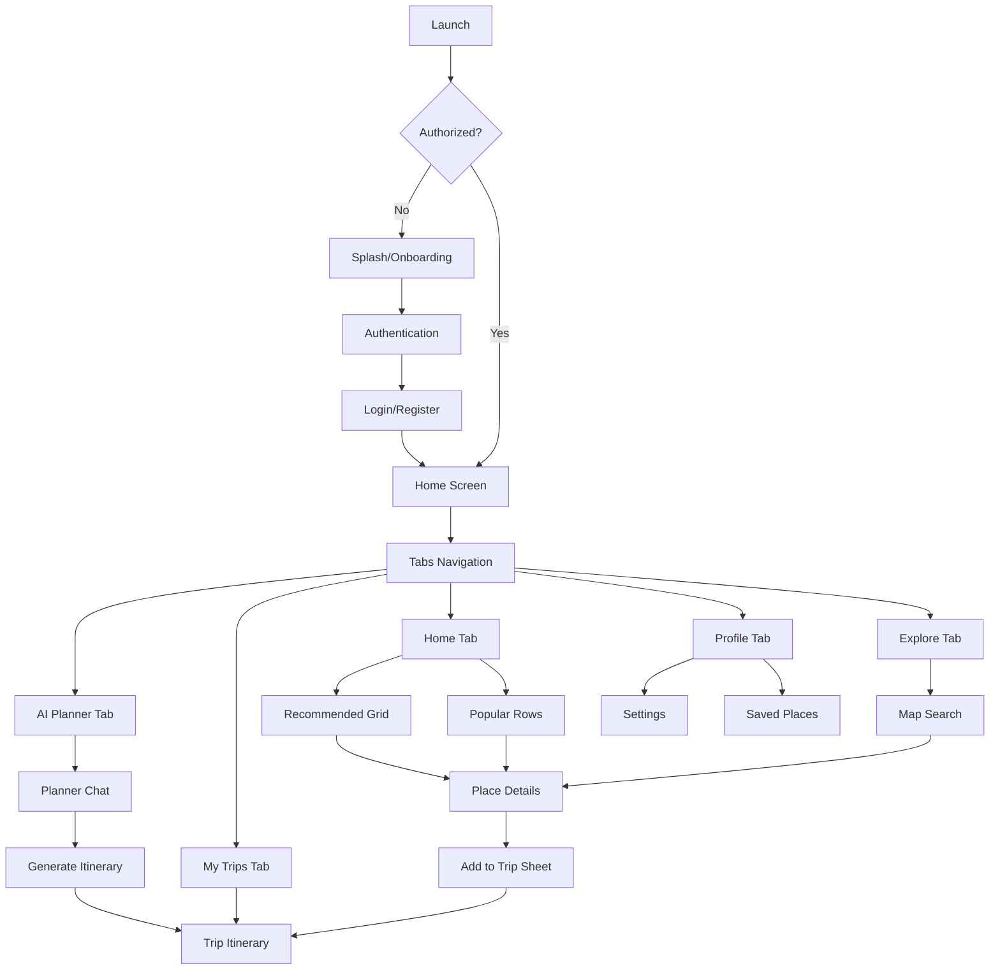

# MindTrip 🌍

MindTrip is a premium Flutter-based travel planning and exploration application that leverages AI to create personalized itineraries and interactive mapping to enhance the travel experience.

## 🚀 Features

### 🗺️ Interactive Exploration
- **Mapbox Integration**: A rich, interactive map experience using Mapbox for navigation, place discovery, and route visualization.
- **Map Search**: Advanced search capabilities to find destinations, attractions, and local spots.

### 🤖 AI-Powered Planning
- **AI Planner Chat**: An intelligent chat interface that helps you plan your perfect trip through natural conversation.
- **Smart Itineraries**: Automatically generated multi-day itineraries based on user preferences and interests.
- **AI Refinement**: Polish and tweak your plans with AI-driven suggestions.

### 🏨 Trip Management
- **My Trips**: Centralized dashboard to view all your upcoming, past, and draft trips.
- **Add to Trip**: Easily save places found during exploration directly to your planned trips.
- **Itinerary View**: Detailed day-by-day breakdown of your travel plans with estimated costs and map previews.

### 👤 Personalized Experience
- **Interests Engine**: Customize your profile with travel interests to get better recommendations.
- **Saved Places**: Keep track of destinations you want to visit.
- **User Profile**: Manage account settings, settings, and travel history.

---

## 🛠️ Technical Stack

- **Framework**: [Flutter](https://flutter.dev/) (Cross-platform UI)
- **Architecture**: **Clean Architecture** (Separation of Data, Domain, and Presentation layers)
- **State Management**: [Bloc/Cubit](https://pub.dev/packages/flutter_bloc)
- **Navigation**: [GoRouter](https://pub.dev/packages/go_router)
- **Networking**: [Dio](https://pub.dev/packages/dio) with custom Interceptors for caching and retry logic.
- **Database**: [Hive](https://pub.dev/packages/hive) (Fast local NoSQL storage)
- **Mapping**: [Mapbox Maps SDK](https://pub.dev/packages/mapbox_maps_flutter)
- **UI Components**: Skeletonizer (for loading states), ScreenUtil (for responsiveness).

---

## 🏛️ Project Structure

The project follows a modular **Clean Architecture** pattern:

```text
lib/
├── core/                  # Shared utilities, themes, routing, and networking
│   ├── shared/            # Core logic shared across features
│   ├── theme/             # Design system and coloring
│   └── utils/             # Helpers and extension methods
└── features/              # Modular feature domains
    ├── ai_planner/        # AI chat and itinerary generation
    ├── authentication/    # User login and registration flow
    ├── map/               # Interactive map and search logic
    ├── trips/             # Trip management and storage
    └── ...                # Other domain-specific features
```

---

## 🔄 Application Flow



---

## 🧠 Knowledge Graph (Graphify)

This project utilizes **Graphify** to maintain a navigable knowledge graph of the codebase. This allows for superior context awareness and architectural auditing.

- **Storage**: `graphify-out/graph.json` contains the full AST-based relationship graph.
- **Navigation**: Access the generated wiki at `graphify-out/wiki/index.md`.
- **Usage**:
  - Run `graphify update .` to sync the graph after making changes.
  - Run `graphify query "your question"` to analyze architectural relationships.

---

## 🛠️ Getting Started

1. **Prerequisites**:
   - Flutter SDK (Latest Stable)
   - Android Studio / VS Code
   - Mapbox Secret Token (Configure in `.env`)

2. **Setup**:
   ```bash
   flutter pub get
   dart run build_runner build --delete-conflicting-outputs
   ```

3. **Running**:
   ```bash
   flutter run
   ```


