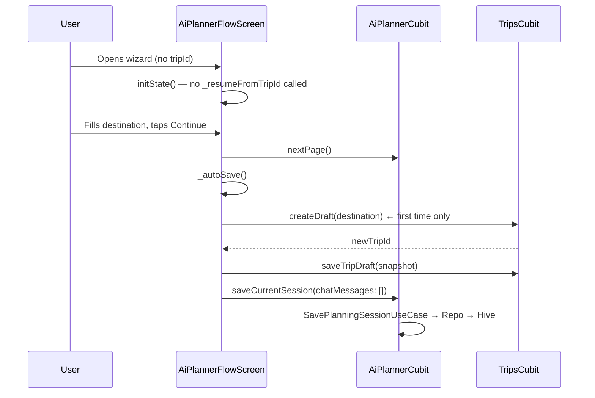
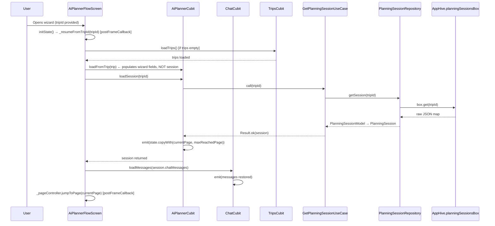
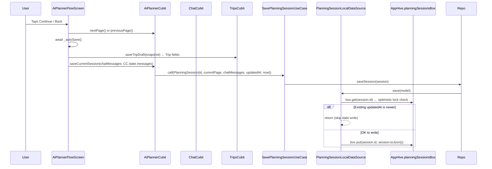
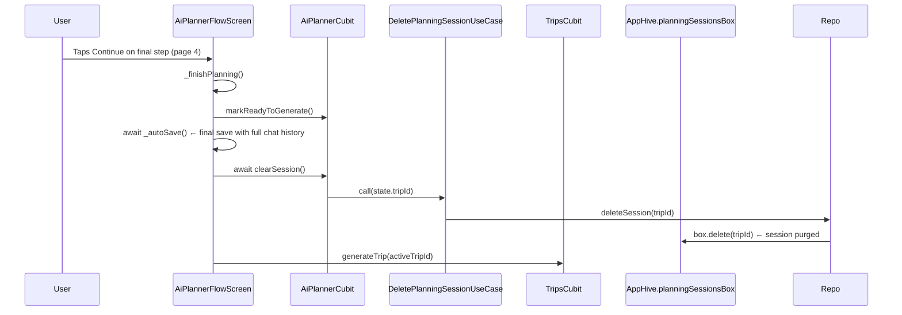

# Planning Session Flow — Complete Reference

> Last updated: 2026-06-04

This document describes **every layer, every function, and every call** in the AI Planning Wizard persistence system. It is the single source of truth for understanding session behaviour, bugs fixed, and backend integration readiness.

---

## Table of Contents

1. [Architecture Overview](#1-architecture-overview)
2. [Layer-by-Layer Breakdown](#2-layer-by-layer-breakdown)
3. [Full Flow Diagrams](#3-full-flow-diagrams)
4. [Function Reference](#4-function-reference)
5. [Bugs Fixed](#5-bugs-fixed)
6. [Backend Integration Readiness](#6-backend-integration-readiness)

---

## 1. Architecture Overview

The planning wizard has **two distinct persistence concerns**:

| Concern | Stored In | Model |
|---|---|---|
| Core trip data (destination, dates, travelers, budget, interests) | Hive `tripsBox` | `Trip` / `TripModel` |
| Transient wizard state (current page, AI chat history) | Hive `planningSessionsBox` | `PlanningSession` / `PlanningSessionModel` |

They are **intentionally decoupled**. The `Trip` entity represents a real travel plan. The `PlanningSession` is ephemeral context that exists only during wizard flow and is **deleted** when the trip is generated.

### Single Writer Principle

`AiPlannerCubit` is the **only** class allowed to write to `PlanningSession`. This eliminates race conditions that would occur if both `AiPlannerCubit` and `ChatCubit` each tried to update the same record.

`AiPlannerFlowScreen` acts as the **orchestrator**: it reads from `ChatCubit` to collect the current messages, then passes them to `AiPlannerCubit.saveCurrentSession()` as a parameter. `ChatCubit` remains a pure feature cubit with no persistence knowledge.

```
AiPlannerCubit ─┐
                 ├─→ FlowScreen._autoSave() ─→ SavePlanningSessionUseCase ─→ PlanningSessionRepository ─→ Hive
ChatCubit ──────┘   (aggregates messages as parameter)
```

---

## 2. Layer-by-Layer Breakdown

### 2.1 Domain Layer

#### `PlanningSession` (entity)
```
lib/features/ai_planner/domain/entities/planning_session.dart
```
| Field | Type | Description |
|---|---|---|
| `id` | `String` | Same as the associated `Trip.id` — the FK link |
| `currentPage` | `int` | The last wizard page the user was on (0–4) |
| `chatMessages` | `List<ChatMessage>` | The AI chat history from the Mindy wizard |
| `updatedAt` | `DateTime` | Timestamp used as an optimistic-lock key for future backend sync |

#### `PlanningSessionRepository` (abstract interface)
```
lib/features/ai_planner/domain/repositories/planning_session_repository.dart
```
| Method | Signature | Description |
|---|---|---|
| `getSession` | `Future<Result<PlanningSession?>> getSession(String tripId)` | Load session by trip ID, returns null if not found |
| `saveSession` | `Future<Result<void>> saveSession(PlanningSession session)` | Persist full session snapshot |
| `deleteSession` | `Future<Result<void>> deleteSession(String tripId)` | Remove session from storage |

#### Use Cases
```
lib/features/ai_planner/domain/usecases/
  get_planning_session_use_case.dart
  save_planning_session_use_case.dart
  delete_planning_session_use_case.dart
```

Each is a `callable` class (`call()` operator) that wraps one repository method. This keeps the `Cubit` isolated from the data layer.

| Use Case | Input | Output |
|---|---|---|
| `GetPlanningSessionUseCase` | `String tripId` | `Result<PlanningSession?>` |
| `SavePlanningSessionUseCase` | `PlanningSession session` | `Result<void>` |
| `DeletePlanningSessionUseCase` | `String tripId` | `Result<void>` |

---

### 2.2 Data Layer

#### `PlanningSessionModel` (DTO)
```
lib/features/ai_planner/data/models/planning_session_model.dart
```
Extends `PlanningSession`. Adds `fromJson`, `toJson`, and `fromEntity` factory.  
Chat messages are serialized via `ChatMessageModel.toJson()` / `fromJson()`.

#### `PlanningSessionLocalDataSource`
```
lib/features/ai_planner/data/datasources/planning_session_local_datasource.dart
```
Uses `AppHive.planningSessionsBox` directly — no `Hive.openBox()` calls needed since the box is opened at app startup by `AppHive.init()`.

| Method | What it does |
|---|---|
| `save(model)` | Reads existing record. If existing `updatedAt` is newer → skips (optimistic lock). Otherwise writes. |
| `getById(id)` | Reads raw map from Hive, deserializes to `PlanningSessionModel`. Returns null if not found. |
| `delete(id)` | Removes the key from the box. |

#### `PlanningSessionRepositoryImpl`
```
lib/features/ai_planner/data/repositories/planning_session_repository_impl.dart
```
Delegates to `PlanningSessionLocalDataSource`. Wraps all calls in try/catch and maps to `Result` using `ApiErrorMapper.fromException`.

#### `AppHive`
```
lib/core/database/cache/app_hive.dart
```
Central Hive manager. Added:
- `static late Box planningSessionsBox;` — opened at startup in `openBoxes()`
- Included in `clearBoxes()` — cleaned on logout/reset alongside all other boxes

---

### 2.3 Presentation Layer

#### `AiPlannerCubit`
```
lib/features/ai_planner/presentation/cubit/ai_planner_cubit.dart
```

**Constructor** — injected with three use cases:
```dart
AiPlannerCubit(
  GetPlanningSessionUseCase,
  SavePlanningSessionUseCase,
  DeletePlanningSessionUseCase,
)
```

**Session-related methods:**

| Method | Description |
|---|---|
| `loadSession(tripId)` | Calls `GetPlanningSessionUseCase`. On success, emits `state.copyWith(currentPage, maxReachedPage)`. Returns the session so `FlowScreen` can also route `chatMessages` to `ChatCubit`. |
| `saveCurrentSession({chatMessages})` | Builds a `PlanningSession` snapshot from current state + the passed-in messages. Calls `SavePlanningSessionUseCase`. No-op if `state.tripId` is null. |
| `clearSession()` | Calls `DeletePlanningSessionUseCase` for `state.tripId`. No-op if `tripId` is null. Called by `FlowScreen` after trip generation is triggered. |
| `loadFromTrip(trip)` | Populates cubit state from a `Trip` entity (destination, dates, travelers, budget, interests). Does **not** call `loadSession` — that is the `FlowScreen`'s responsibility. |
| `markReadyToGenerate()` | Sets `maxReachedPage = 5` (past the last wizard step) as a signal to the listener that generation is starting. |
| `toTripSnapshot({tripId})` | Builds a `Trip` entity from current cubit state, used to persist the draft before generating. |

**Wizard navigation methods (pure state, no persistence):**

| Method | Description |
|---|---|
| `nextPage()` | Increments `currentPage` (max 4), updates `maxReachedPage` |
| `previousPage()` | Decrements `currentPage` (min 0) |
| `setPage(page)` | Sets page directly, updates `maxReachedPage` |
| `reset()` | Emits fresh initial state |

**Form field methods (all pure state emits):**
`updateDestinationQuery`, `selectDestination`, `selectTripDate`, `nextMonth`, `previousMonth`, `changeMonth`, `changeAdults`, `changeChildren`, `changePets`, `selectBudget`, `updateCustomBudget`, `toggleInterest`, `getFilteredDestinations`

---

#### `ChatCubit`
```
lib/features/ai_planner/presentation/cubit/chat_cubit.dart
```
**Fully decoupled from persistence.** Has no reference to any repository or use case related to sessions. It is a pure feature cubit: manages the chat message list and calls `SendMessageUseCase`.

`FlowScreen` reads `_chatCubit.state.messages` when calling `_autoSave()`, then passes them into `AiPlannerCubit.saveCurrentSession()`.

---

#### `AiPlannerFlowScreen`
```
lib/features/ai_planner/presentation/screens/ai_planner_flow_screen.dart
```
The **orchestrator**. All cross-cubit coordination happens here.

---

## 3. Full Flow Diagrams

### 3.1 New Trip (Fresh Start)



### 3.2 Resume Session



### 3.3 Auto-Save (every page step)



### 3.4 Finish Planning / Trip Generation



---

## 4. Function Reference

### `AiPlannerFlowScreen`

| Function | Async | Description |
|---|---|---|
| `initState()` | — | Reads cubits from context. Registers text controller listeners (guarded with `isClosed`). Calls `_resumeFromTripId` via `postFrameCallback` if `tripId` is provided. |
| `_resumeFromTripId(tripId)` | ✅ | Full resume sequence: loads trips if needed → `loadFromTrip` → `loadSession` → `chatCubit.loadMessages` → `jumpToPage`. |
| `dispose()` | — | Disposes `PageController`, two `TextEditingController`s, and `ScrollController`. |
| `_handleBack(isLeaving)` | ✅ | If on page 0 or force-leaving: `_autoSave` then `context.pop`. Otherwise: `previousPage` then `_autoSave`. |
| `_onStepCompleted()` | ✅ | If not on last page: `nextPage` then `await _autoSave`. If on last page: calls `_finishPlanning`. |
| `_autoSave()` | ✅ | Guards: both cubits must be open, destination must be set. Creates draft first time. Saves `Trip` snapshot, then saves `PlanningSession` with current chat messages. |
| `_finishPlanning()` | ✅ | Guards cubits. `markReadyToGenerate` → `_autoSave` → `clearSession` → `generateTrip`. |
| `build()` | — | UI: `PopScope` wraps `Scaffold`. `PageView` with 5 steps. Header row with back/progress/close. FAB shown when keyboard is closed and not on chat page. |

### `AiPlannerCubit`

| Function | Async | Description |
|---|---|---|
| `loadSession(tripId)` | ✅ | Calls use case. Emits page state. Returns `PlanningSession?` to caller. |
| `saveCurrentSession({chatMessages})` | ✅ | Builds session from state + passed messages. Calls use case. No-op if no `tripId`. |
| `clearSession()` | ✅ | Calls delete use case. No-op if no `tripId`. |
| `loadFromTrip(trip)` | — | Populates wizard fields from `Trip`. Does NOT call `loadSession`. |
| `markReadyToGenerate()` | — | Sets `maxReachedPage = 5`. |
| `toTripSnapshot({tripId})` | — | Returns a `Trip` entity from current state. |
| `nextPage()` | — | Increments page, updates max. |
| `previousPage()` | — | Decrements page. |
| `setPage(page)` | — | Sets page directly. |
| `reset()` | — | Clears all state. |

### `PlanningSessionLocalDataSource`

| Method | Async | Description |
|---|---|---|
| `save(model)` | ✅ | Reads existing. Rejects write if existing `updatedAt` is newer (optimistic lock). Writes JSON to box. |
| `getById(id)` | ✅ | Reads raw map. Returns `null` if absent. Deserializes to model. |
| `delete(id)` | ✅ | Deletes key from box. |

---

## 5. Bugs Fixed

### Bug 1 — Double `loadSession` (race condition)

**Problem**: `loadFromTrip()` internally called `loadSession(trip.id)` as a fire-and-forget. `FlowScreen._resumeFromTripId` then also called `loadSession`. This caused two concurrent reads/emits, and the unawaited one from `loadFromTrip` could overwrite page state after the `FlowScreen` had already jumped the page controller.

**Fix**: Removed the `loadSession` call from `loadFromTrip`. The `FlowScreen` is now the sole orchestrator — it calls `loadFromTrip` (synchronous), then awaits `loadSession`, then routes chat messages to `ChatCubit`.

---

### Bug 2 — Hive box opened on every call

**Problem**: Every `save`, `getById`, and `delete` call did `await Hive.openBox('planning_sessions')`. Even though Hive efficiently returns the same instance if already open, this was fragile (potential for mismatched box name/type options) and inconsistent with how all other boxes are managed in the app.

**Fix**: Added `planningSessionsBox` to `AppHive`. The box is opened once during `AppHive.init()` at app startup. The data source uses `AppHive.planningSessionsBox` directly — synchronous access, no async required.

---

### Bug 3 — `_onStepCompleted` not awaiting `_autoSave`

**Problem**: `_onStepCompleted` was `void` and called `_autoSave()` without `await`. If the user tapped Continue quickly, multiple concurrent `_autoSave` calls could fire, potentially creating the trip draft multiple times (`createDraft` is idempotent but the race was real).

**Fix**: Changed to `Future<void> _onStepCompleted() async` and added `await _autoSave()`.

---

### Bug 4 — Optimistic lock: no `updatedAt` comparison before write

**Problem**: When a remote backend is introduced, records synced from the server could be overwritten by stale local saves if both devices were active simultaneously. The `updatedAt` field existed on the entity but was never used to gate writes.

**Fix**: `PlanningSessionLocalDataSource.save()` now reads the existing record first. If `existingModel.updatedAt.isAfter(session.updatedAt)`, the write is silently skipped. Locally this is effectively a no-op since we always set `updatedAt: DateTime.now()` when saving, but the guard is correctly in place for future remote-sync scenarios.

---

### Bug 5 (Cleanup) — Session never deleted after trip generation

**Problem**: The `deleteSession` method existed in the repository interface but was never called. After a trip is fully generated, the planning chat history has no value. Leaving it in Hive wastes storage and could incorrectly restore stale chat history if a user navigated back to the same wizard.

**Fix**: Added `clearSession()` to `AiPlannerCubit` backed by `DeletePlanningSessionUseCase`. Called by `FlowScreen._finishPlanning()` after the final `_autoSave` and before `generateTrip`. Also, `AppHive.clearBoxes()` now includes `planningSessionsBox` for full cleanup on logout/reset.

---

## 6. Backend Integration Readiness

### What's ready ✅

| Item | Status |
|---|---|
| Repository interface is fully abstract | ✅ Swap impl without touching cubit or UI |
| Use cases are isolated from data layer | ✅ No changes needed to cubit on backend swap |
| `PlanningSessionModel.toJson()` / `fromJson()` | ✅ Clean JSON ready for API transport |
| `deleteSession` is wired end-to-end | ✅ Called on trip generation |
| `updatedAt` field on entity + optimistic lock guard in data source | ✅ Foundation for conflict resolution |
| `clearBoxes()` includes `planningSessionsBox` | ✅ Clean logout |

### What needs to be built for backend ❌

#### 1. Remote Data Source
```
lib/features/ai_planner/data/datasources/
    planning_session_remote_datasource.dart   ← CREATE THIS
```
Methods:
- `Future<PlanningSessionModel?> getSession(String tripId)` → `GET /sessions/{tripId}`
- `Future<void> saveSession(PlanningSessionModel model)` → `PUT /sessions/{tripId}`
- `Future<void> deleteSession(String tripId)` → `DELETE /sessions/{tripId}`

#### 2. Update `PlanningSessionRepositoryImpl` to offline-first

```dart
// Recommended strategy:
class PlanningSessionRepositoryImpl implements PlanningSessionRepository {
  final PlanningSessionLocalDataSource _local;
  final PlanningSessionRemoteDataSource _remote; // ADD THIS

  @override
  Future<Result<PlanningSession?>> getSession(String tripId) async {
    // Try remote first, fall back to local cache
    final remote = await _remote.getSession(tripId);
    if (remote != null) {
      await _local.save(remote); // update local cache
      return Result.ok(remote);
    }
    final local = await _local.getById(tripId);
    return Result.ok(local);
  }

  @override
  Future<Result<void>> saveSession(PlanningSession session) async {
    // Always write local immediately, sync remote in background
    final model = PlanningSessionModel.fromEntity(session);
    await _local.save(model);
    await _remote.saveSession(model); // could be fire-and-forget with retry queue
    return const Result.ok(null);
  }
}
```

#### 3. Conflict resolution strategy (multi-device)

When the remote returns a session with a newer `updatedAt` than the local:
- The `save()` optimistic lock will correctly reject the stale local write.
- On `getSession`, always prefer the record with the **later** `updatedAt`.

```dart
// In getSession (once remote is added):
if (remote != null && local != null) {
  return remote.updatedAt.isAfter(local.updatedAt) ? remote : local;
}
```

#### 4. Sync queue for offline writes

If the device is offline when `saveSession` is called, the local write succeeds but the remote write fails. A sync queue (similar to `favoritesSyncQueueBox` already in `AppHive`) is needed to retry failed remote writes on reconnect.

---

> **Summary**: The local-only implementation is complete, correct, and production-ready. The abstract boundaries are in place so that adding the remote data source is a purely additive change — no cubit, use case, or UI code needs to be modified.
