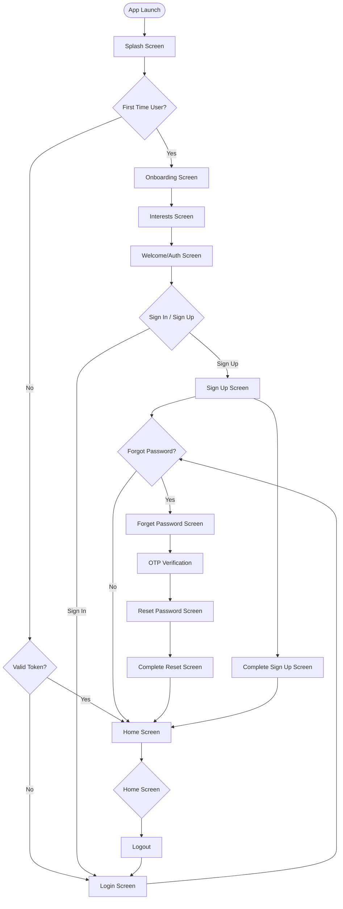
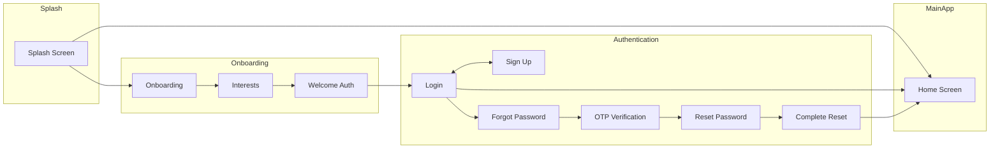
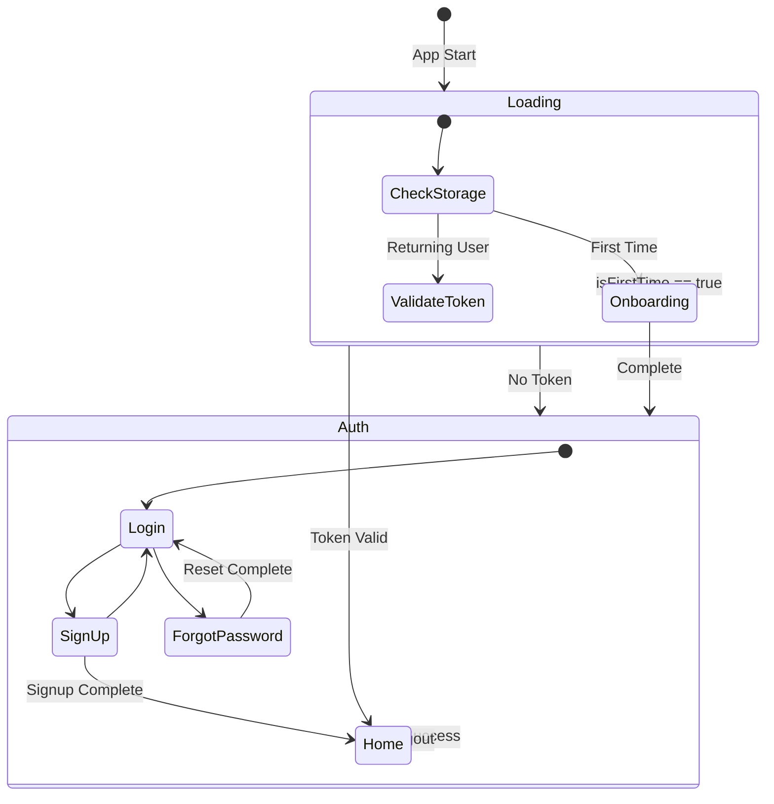

# MindTrip App - User Flow Diagram

## Authentication & Onboarding Flow



## Navigation Flow



## State-Based Routing Logic



## Key Screens

| Screen           | Route                          | Description                   |
| ---------------- | ------------------------------ | ----------------------------- |
| Splash           | `/splash`                      | App initialization            |
| Onboarding       | `/onboarding`                  | Welcome screens for new users |
| Interests        | `/interests`                   | Select user interests         |
| Welcome Auth     | `/welcomeauth`                 | Prompt to login/signup        |
| Login            | `/login`                       | Sign in form                  |
| Sign Up          | `/signup`                      | Registration form             |
| Forgot Password  | `/forgetPassword`              | Password reset request        |
| OTP Verification | `/otpVerification`             | Verify reset code             |
| Reset Password   | `/resetPassword`               | Set new password              |
| Complete Sign Up | `/completeSignUpScreen`        | Finish registration           |
| Complete Reset   | `/completeResetPasswordScreen` | Confirm password reset        |
| Home             | `/home`                        | Main app screen               |

## Gate States (AppGateCubit)

```
AppGateLoading → AppGateOnboarding → AppGateUnauthenticated → AppGateAuthenticated
                        ↓                   ↓                       ↓
                   (isFirstTime)       (no token)              (logged in)
```
